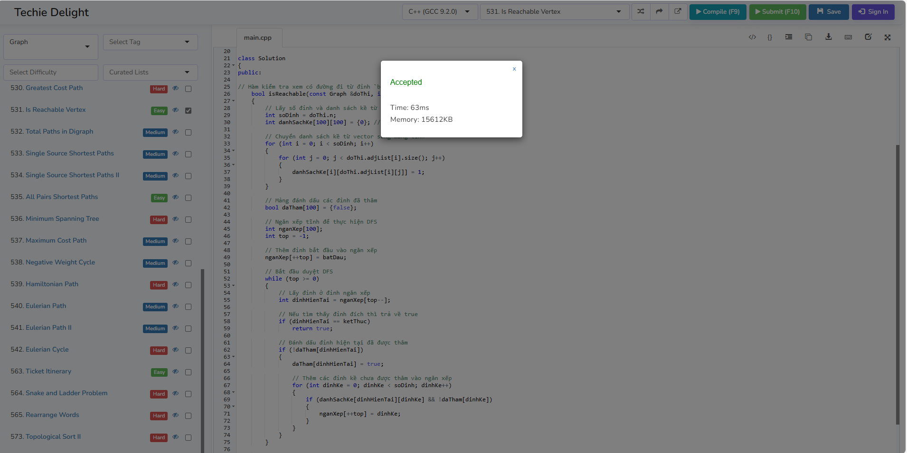
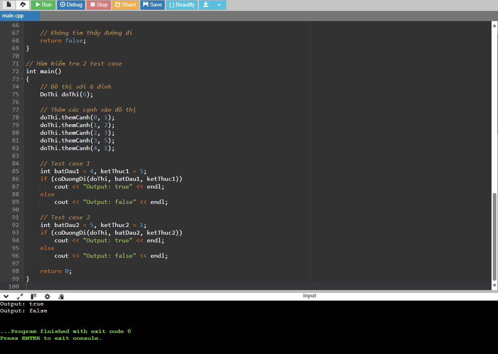

# Giải thuật Kiểm tra Đường đi trong Đồ thị

Giải thuật này kiểm tra xem có tồn tại đường đi từ một đỉnh `src` đến đỉnh `dest` trong đồ thị hay không. Đồ thị được biểu diễn dưới dạng ma trận kề, và giải thuật sử dụng phương pháp duyệt theo chiều sâu (DFS) để tìm kiếm đường đi giữa hai đỉnh trong đồ thị.

## Các bước phân tích giải thuật

### 1. Biểu diễn đồ thị:
Đồ thị được biểu diễn dưới dạng ma trận kề. Mỗi phần tử `danhSachKe[u][v]` có giá trị `1` nếu có cạnh giữa các đỉnh `u` và `v`, ngược lại là `0`.

### 2. Khởi tạo:
- Tạo mảng `daTham[]` với kích thước bằng số lượng đỉnh trong đồ thị, và khởi tạo tất cả phần tử là `false` để đánh dấu các đỉnh chưa được thăm.
- Sử dụng ngăn xếp (stack) để duyệt qua các đỉnh trong đồ thị.

### 3. Duyệt đồ thị:
- Đưa đỉnh `src` vào ngăn xếp.
- Duyệt qua các đỉnh trong ngăn xếp theo phương pháp DFS:
  - Nếu đỉnh hiện tại là `dest`, trả về `true` (có đường đi).
  - Đánh dấu đỉnh đã thăm và thêm các đỉnh kề chưa thăm vào ngăn xếp.

### 4. Kết quả:
- Nếu tìm thấy đường đi từ `src` đến `dest`, trả về `true`.
- Nếu duyệt hết mà không tìm thấy, trả về `false`.

## Ví dụ và Kết quả

**Input**:


```text
Đồ thị với 6 đỉnh, các cạnh:
[(0, 1), (1, 2), (2, 3), (3, 5), (4, 1)]
Test case 1: src = 4, dest = 5

Test case 2: src = 5, dest = 1

Output:

Test case 1: true
Test case 2: false
```
### Test trên trang Techiedelight


### Code C++ test 



Link trong 500 bài code: https://www.techiedelight.com/2-vertex-connectivity-graph/


# Mô phỏng Thuật Toán Tìm Đường Đi (DFS) với Ngăn Xếp

## Mô tả Bài Toán

Hàm `CoDuongDi` kiểm tra xem liệu có tồn tại đường đi từ đỉnh bắt đầu (`src`) đến đỉnh kết thúc (`dest`) trong một đồ thị có hướng, được biểu diễn dưới dạng **ma trận kề**. Thuật toán sử dụng **Duyệt theo chiều sâu (DFS)** với **ngăn xếp** để thực hiện việc kiểm tra.

---

## Thuật Toán
1. **Khởi tạo:**
   - Tạo mảng `daTham`, tất cả các phần tử ban đầu là `false`, để đánh dấu các đỉnh đã được thăm.
   - Tạo ngăn xếp `nganXep` chứa đỉnh bắt đầu (`src`).

2. **Duyệt đồ thị:**
   - Lặp lại cho đến khi ngăn xếp rỗng:
     - Lấy đỉnh `dinhHienTai` từ đỉnh trên cùng của ngăn xếp.
     - Nếu `dinhHienTai` là đỉnh đích (`dest`), trả về `true`.
     - Đánh dấu đỉnh `dinhHienTai` là đã thăm.
     - Đưa các đỉnh kề của `dinhHienTai` (chưa được thăm) vào ngăn xếp.

3. **Kết thúc:**
   - Nếu ngăn xếp rỗng mà vẫn chưa tìm thấy `dest`, trả về `false`.

---

## Dữ Liệu Đầu Vào và Biểu Diễn

### Đầu Vào:
- Danh sách cạnh của đồ thị: 
  ```
  [(0, 1), (1, 2), (2, 3), (3, 5), (4, 1)]
  ```
- Đỉnh bắt đầu (**`src`**) = 4
- Đỉnh kết thúc (**`dest`**) = 5

### Biểu Diễn:
Chuyển danh sách cạnh sang **ma trận kề** dạng 6x6 (đồ thị có đỉnh từ `0` đến `5`):
```
      0  1  2  3  4  5
  0   0  1  0  0  0  0
  1   0  0  1  0  0  0
  2   0  0  0  1  0  0
  3   0  0  0  0  0  1
  4   0  1  0  0  0  0
  5   0  0  0  0  0  0
```

---

## Mô Phỏng Từng Bước Thay Đổi

### Khởi tạo:
- **Mảng `daTham`:** `[false, false, false, false, false, false]`
- **Ngăn xếp `nganXep`:** `[4]` (đưa `src` vào ngăn xếp)

---

### Bước 1:
- Lấy `4` ra khỏi ngăn xếp → `dinhHienTai = 4`
- Đánh dấu `daTham[4] = true` → `[false, false, false, false, true, false]`
- Đỉnh kề của `4`: `1` (DoThi[4][1] == 1). Đưa `1` vào ngăn xếp.
- **Ngăn xếp hiện tại:** `[1]`

---

### Bước 2:
- Lấy `1` ra khỏi ngăn xếp → `dinhHienTai = 1`
- Đánh dấu `daTham[1] = true` → `[false, true, false, false, true, false]`
- Đỉnh kề của `1`: `2` (DoThi[1][2] == 1). Đưa `2` vào ngăn xếp.
- **Ngăn xếp hiện tại:** `[2]`

---

### Bước 3:
- Lấy `2` ra khỏi ngăn xếp → `dinhHienTai = 2`
- Đánh dấu `daTham[2] = true` → `[false, true, true, false, true, false]`
- Đỉnh kề của `2`: `3` (DoThi[2][3] == 1). Đưa `3` vào ngăn xếp.
- **Ngăn xếp hiện tại:** `[3]`

---

### Bước 4:
- Lấy `3` ra khỏi ngăn xếp → `dinhHienTai = 3`
- Đánh dấu `daTham[3] = true` → `[false, true, true, true, true, false]`
- Đỉnh kề của `3`: `5` (DoThi[3][5] == 1). Đưa `5` vào ngăn xếp.
- **Ngăn xếp hiện tại:** `[5]`

---

### Bước 5:
- Lấy `5` ra khỏi ngăn xếp → `dinhHienTai = 5`
- Kiểm tra: `dinhHienTai == dest` → Đúng
- **Kết luận:** Tồn tại đường đi từ `4` đến `5`.

---

## Kết Quả Cuối Cùng
- Trả về: **`true`** (Có đường đi từ `src = 4` đến `dest = 5`).

---

## Tóm Tắt Thay Đổi Ngăn Xếp và Mảng `daTham`

| Bước | Hành động              | Ngăn xếp       | `daTham`                 |
|------|------------------------|----------------|--------------------------|
| 0    | Khởi tạo              | `[4]`          | `[false, false, false, false, false, false]` |
| 1    | Lấy `4`, thêm `1`     | `[1]`          | `[false, false, false, false, true, false]`  |
| 2    | Lấy `1`, thêm `2`     | `[2]`          | `[false, true, false, false, true, false]`   |
| 3    | Lấy `2`, thêm `3`     | `[3]`          | `[false, true, true, false, true, false]`    |
| 4    | Lấy `3`, thêm `5`     | `[5]`          | `[false, true, true, true, true, false]`     |
| 5    | Lấy `5` → Kết thúc    | `[]`           | `[false, true, true, true, true, false]`     |

---

## Độ Phức Tạp
- Thời gian: **O(V + E)**, trong đó:
  - `V` là số đỉnh.
  - `E` là số cạnh.
- Không gian: **O(V)**, sử dụng thêm mảng `daTham` và ngăn xếp.

---

